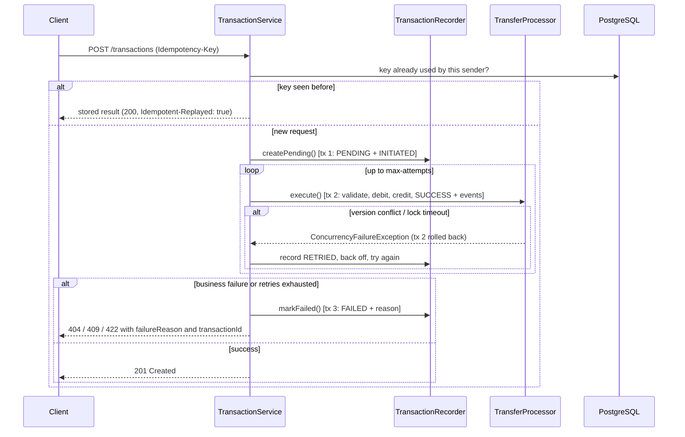

# PayFlow API

[](https://github.com/vikashinikaruppusamyk/payflow-api/actions/workflows/ci.yml)

A Spring Boot REST API for a UPI-style digital wallet. Users register with a UPI ID, send money to each other and view their statements.

The focus is on **keeping money correct**: transfers are atomic, stay correct under concurrent requests, are safe to retry, and leave an audit trail. A test suite proves each of these properties.

## Highlights

| Problem | How PayFlow handles it |
|---|---|
| Partial transfers (debit saved, credit lost) | Debit, credit and status update run in **one database transaction** |
| Two requests overdrawing the same account at once | **Optimistic locking** (`@Version`) with automatic retry; proven by a 100-thread test |
| Deadlock between opposite transfers (A→B while B→A) | Hibernate flushes updates in primary-key order (`hibernate.order_updates`) |
| Client retries after a timeout and pays twice | **Idempotency-Key** header; retries replay the stored result |
| Failed transfers disappearing | Every attempt is stored as `PENDING` → `SUCCESS` / `FAILED` with a reason |
| Floating-point rounding | Money is `BigDecimal` / `NUMERIC(19,2)` everywhere |
| Bad input reaching the service | Bean Validation on request DTOs; JPA entities are never exposed |
| Understanding where transfers fail | Event log per transfer (`INITIATED → … → COMPLETED/FAILED`), exportable as CSV for process mining |

## Tech stack

Java 17 · Spring Boot 3.5 (Web, Data JPA, Validation) · PostgreSQL · Flyway · springdoc-openapi (Swagger UI) · JUnit 5, Mockito, MockMvc · JaCoCo · GitHub Actions

## Architecture

```
controller   REST endpoints, request validation, HTTP status codes
    │
service      TransactionService  – orchestrates a transfer: idempotency check, retries, failure recording
    │        TransferProcessor   – one transfer attempt in one @Transactional unit
    │        TransactionRecorder – PENDING / FAILED / event writes in their own transactions (REQUIRES_NEW)
    │        UserService, StatementService, EventLogService
    │
repository   Spring Data JPA repositories
    │
PostgreSQL   schema owned by Flyway migrations (src/main/resources/db/migration)
```

### Life of a transfer



## Design decisions

**Atomic transfers.** `TransferProcessor.execute` is `@Transactional`: the debit, the credit, the `SUCCESS` status and the step events commit together or not at all. `TransferAtomicityTest` forces the database to reject the credit after the debit has been issued, then checks that the debit was rolled back.

**Optimistic over pessimistic locking.** `User` has a `@Version` column. If two transfers read the same balance, the second one to commit updates zero rows and fails with an optimistic locking exception instead of silently overwriting the first. `TransactionService` retries the whole attempt with a short random back-off (default 3 attempts), then returns `409`. Most transfers touch different accounts, so conflicts are rare, and optimistic locking holds no row locks while the balance is checked. For a small set of accounts that are updated constantly, `SELECT … FOR UPDATE` would be the better trade-off.

**Why the retry loop lives in a different bean.** `@Transactional` works through a Spring proxy. A method calling another method on the same object bypasses the proxy, so the call runs without a new transaction. Keeping the loop in `TransactionService` and the transactional attempt in `TransferProcessor` gives every retry a fresh transaction.

**Recording failures that would otherwise be rolled back.** If a `FAILED` row were saved inside the transfer transaction, the rollback would erase it. `TransactionRecorder` writes `PENDING` and `FAILED` in separate `REQUIRES_NEW` transactions, so every attempt stays in the audit trail.

**Idempotency.** Clients send an `Idempotency-Key` (e.g. a UUID) per transfer and reuse it when retrying:

- **First request:** `201 Created`.
- **Retry with the same body:** `200` with the original result and an `Idempotent-Replayed: true` header.
- **Retry while the first request is still running:** `409`.
- **Same key with a different body:** `422`.

Keys are unique per sender, enforced by a database constraint. If two identical requests race past the lookup, the constraint lets exactly one insert win and the other replays its result.

**Defence in depth.** The service enforces the rules, and the database enforces them again:
- `CHECK (balance >= 0)`
- `CHECK (amount > 0)`
- unique UPI IDs
- allowed status values

The schema is versioned with Flyway, and Hibernate runs with `ddl-auto=validate`.

**Event log for process mining.** Each transfer writes one row per step: `INITIATED`, `VALIDATED`, `DEBITED`, `CREDITED`, `COMPLETED`, or `RETRIED` / `FAILED` / `REPLAYED`. This is the case-id / activity / timestamp format that process-mining tools read. `GET /events/export` downloads it as CSV, so you can analyse where transfers fail, how often they retry and how long each step takes.

## Running locally

**Prerequisites:** Java 17+ and PostgreSQL. You don't need to install Maven because the wrapper is included.

1. Create the database:
   ```bash
   psql -U postgres -c "CREATE DATABASE payflow;"
   ```
2. Configure the connection. Copy `local.properties.example` to `local.properties` (git ignores it) and set `DB_PASSWORD`. Every key can also be set as an environment variable (`DB_URL`, `DB_USERNAME`, `DB_PASSWORD`).
3. Start the app. Flyway creates the tables on first start.
   ```bash
   ./mvnw spring-boot:run
   ```
   On Windows use `mvnw.cmd spring-boot:run`, or run `PayflowApplication` from IntelliJ.
4. Open Swagger UI at http://localhost:8080/swagger-ui.html.

## Tests

```bash
./mvnw verify
```

The suite has 61 tests: unit tests, API tests and concurrency tests. It runs against an in-memory H2 database in PostgreSQL mode, so it needs no setup. The coverage report is written to `target/site/jacoco/index.html` (about 93% line coverage, 97% in the service layer).

To run the same suite against a real PostgreSQL database, set:
- `TEST_DB_URL`, e.g. `jdbc:postgresql://localhost:5432/payflow_test`
- `TEST_DB_USERNAME`
- `TEST_DB_PASSWORD`

CI runs the suite on both H2 and PostgreSQL for every push.

The concurrency tests check invariants that must hold however the threads interleave:
- **One sender, 100 simultaneous transfers:** the total amount of money is unchanged, and every successful transfer has exactly one `SUCCESS` row and one `COMPLETED` event.
- **50 transfers of 10.00 against a balance of 100.00:** at most 10 succeed and the balance never goes negative.
- **Opposite transfers A→B and B→A at the same time:** no deadlock errors and no money lost.

Removing `@Version` from `User` makes all three fail. In one run, an account with 100.00 accepted all 50 transfers of 10.00.

## API

| Method | Endpoint | Description |
|---|---|---|
| POST | `/users` | Register a user (`201`, `409` if the UPI ID is taken) |
| GET | `/users?minBalance=500` | List users, optionally with balance ≥ `minBalance` |
| GET | `/users/{userId}` | User by id |
| GET | `/users/upi/{upiId}` | User by UPI ID (case-insensitive) |
| GET | `/users/{upiId}/transactions?page=0&size=20&status=SUCCESS` | Paginated statement, newest first, with DEBIT/CREDIT direction |
| POST | `/transactions` | Send money (optional `Idempotency-Key` header) |
| GET | `/transactions/{id}` | Any transfer, including failed ones |
| GET | `/transactions/{id}/events` | Life-cycle events of one transfer |
| GET | `/events/export?from=&to=` | Event log as CSV |

### Example

```bash
curl -X POST localhost:8080/users -H "Content-Type: application/json" \
  -d '{"name":"Priya","upiId":"priya@okaxis","initialBalance":1000,"phoneNumber":"9876543210"}'

curl -X POST localhost:8080/users -H "Content-Type: application/json" \
  -d '{"name":"Ravi","upiId":"ravi@oksbi"}'

curl -X POST localhost:8080/transactions -H "Content-Type: application/json" \
  -H "Idempotency-Key: 3f6c1a52-rent-june" \
  -d '{"senderUpiId":"priya@okaxis","receiverUpiId":"ravi@oksbi","amount":250.50,"note":"rent"}'
```

```json
{
  "transactionId": 1,
  "senderUpiId": "priya@okaxis",
  "receiverUpiId": "ravi@oksbi",
  "amount": 250.50,
  "note": "rent",
  "status": "SUCCESS",
  "failureReason": null,
  "createdAt": "2026-09-18T12:40:01.512",
  "completedAt": "2026-09-18T12:40:01.538"
}
```

### Errors

Every error has the same shape:

```json
{
  "timestamp": "2026-09-18T07:10:01.120Z",
  "status": 422,
  "error": "Unprocessable Entity",
  "message": "Insufficient balance",
  "path": "/transactions",
  "failureReason": "INSUFFICIENT_BALANCE",
  "transactionId": 2
}
```

| Status | When |
|---|---|
| 400 | Validation errors (with `fieldErrors`), malformed JSON, self-transfer |
| 404 | Unknown user, sender, receiver or transaction |
| 409 | Duplicate UPI ID, concurrent update after retries, same Idempotency-Key still in progress |
| 422 | Insufficient balance, Idempotency-Key reused with a different body |

## Project structure

```
src/main/java/com/example/payflow
├── config        OpenAPI metadata
├── controller    UserController, TransactionController, EventLogController
├── dto           Request/response records, validation patterns, error and page shapes
├── entity        User, Transaction, TransactionEvent and their enums
├── exception     PayFlowException hierarchy and GlobalExceptionHandler
├── repository    Spring Data JPA repositories (derived queries and JPQL)
└── service       Transfer orchestration, processing, recording, statements, event log
src/main/resources/db/migration   Flyway SQL migrations
```

## Known limitations and next steps

- **Stuck `PENDING` transfers.** If the process crashes after a transfer is recorded as `PENDING` but before it finishes, the row stays `PENDING`. A scheduled reconciliation job would resolve these.
- **Balances are updated in place.** A double-entry ledger (immutable debit/credit entries, with balance derived from them) is the usual next step for auditability.
- **No authentication yet.** Any caller can move money from any account. Spring Security with per-user authorisation would come next.
- **Single database.** Scaling out would mean sharding accounts. A transfer between accounts on different shards, or in different services, would need a saga or the outbox pattern instead of one local transaction.
